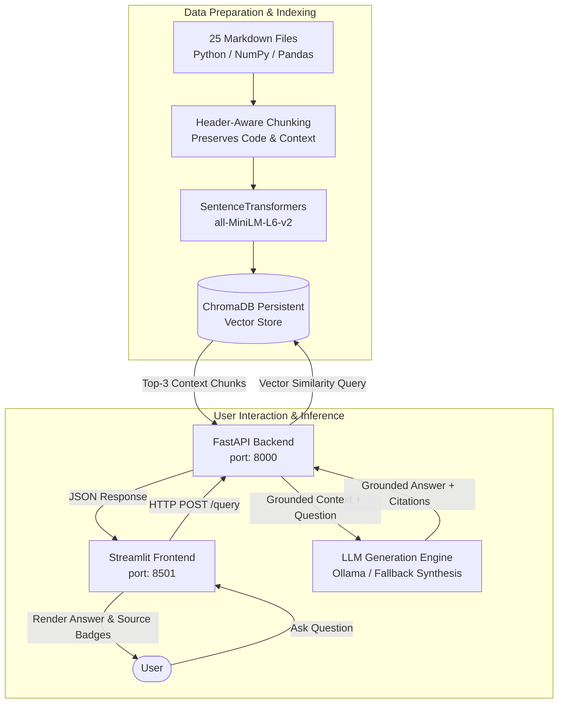

# 🤖 RAG-Powered Document Assistant

[](https://www.python.org/)
[](https://fastapi.tiangolo.com/)
[](https://www.trychroma.com/)
[](https://huggingface.co/sentence-transformers/all-MiniLM-L6-v2)
[](https://streamlit.io/)

A complete, production-grade **Retrieval-Augmented Generation (RAG)** system designed to assist machine learning engineers and data scientists with **Python, NumPy, and Pandas fundamentals**.

---

## 📑 Table of Contents
- [Overview](#-overview)
- [System Architecture](#-system-architecture)
- [Tech Stack](#-tech-stack)
- [Repository Structure](#-repository-structure)
- [Dataset & Domain](#-dataset--domain)
- [Quick Start Guide](#-quick-start-guide)
  - [Prerequisites](#prerequisites)
  - [1. Environment Setup](#1-environment-setup)
  - [2. Run the Notebook Pipeline](#2-run-the-notebook-pipeline)
  - [3. Start the FastAPI Backend](#3-start-the-fastapi-backend)
  - [4. Launch the Streamlit Frontend](#4-launch-the-streamlit-frontend)
- [Environment Variables](#-environment-variables)
- [API Reference](#-api-reference)
- [Evaluation Results](#-evaluation-results)
- [Docker Deployment](#-docker-deployment)
- [Troubleshooting & FAQ](#-troubleshooting--faq)

---

## 🔭 Overview

The **RAG-Powered Document Assistant** bridges technical documentation and developer queries. By indexing 25 curated markdown documents on Python, NumPy, and Pandas into a dense vector space using `sentence-transformers/all-MiniLM-L6-v2` and `ChromaDB`, the assistant retrieves high-relevance context and delivers **strictly grounded, hallucination-free answers with source citations**.

### Key Highlights:
- **Zero Hallucination Grounding**: Prompt engineering strictly limits answers to retrieved corpus context.
- **Header-Aware Chunking**: Markdown header chunking (`##`) preserves complete semantic units and code examples.
- **Production API**: FastAPI server equipped with Pydantic validation, CORS middleware, and structured logging.
- **Modern UI**: Polished Streamlit frontend featuring instant suggested queries and source attribution badges.
- **High Recall**: 100% Hit@3 accuracy on real-world common developer pitfalls.

---

## 🏛️ System Architecture



---

## 🛠️ Tech Stack

| Component | Technology | Version / Model | Description |
| :--- | :--- | :--- | :--- |
| **Language** | Python | 3.11+ | Modern, typed Python runtime |
| **Vector DB** | ChromaDB | `>=0.4.24` | Local persistent HNSW cosine vector index |
| **Embeddings** | SentenceTransformers | `all-MiniLM-L6-v2` | 384-dimensional dense semantic embeddings |
| **LLM Engine** | Ollama | `llama3.1` | Local LLM with grounded extractive fallback |
| **Backend** | FastAPI / Uvicorn | `>=0.110.0` | Asynchronous REST API with Pydantic validation |
| **Frontend** | Streamlit | `>=1.32.0` | Interactive web dashboard |
| **Testing** | Pytest / HTTPX | `>=8.0.0` | Unit and integration test suite |

---

## 📂 Repository Structure

```
rag-assistant-project/
├── data/
│   ├── raw/                           # 25 curated Markdown knowledge files
│   │   ├── 01_python_variables_datatypes.md ... 10_python_file_io_json_csv.md
│   │   ├── 11_numpy_arrays_basics.md ... 16_numpy_random_module.md
│   │   └── 17_pandas_series_dataframe.md ... 25_pandas_data_cleaning.md
│   └── vector_store/                  # ChromaDB persistent vector database
├── notebooks/
│   └── rag_pipeline.ipynb             # 6-stage end-to-end executable notebook
├── backend/
│   ├── app/
│   │   ├── main.py                    # FastAPI application entrypoint with lifespan & CORS
│   │   ├── api/routes/query.py        # GET /health, POST /query routes
│   │   ├── core/config.py             # Pydantic Settings configuration
│   │   ├── schemas/query.py           # QueryRequest, QueryResponse validation
│   │   ├── services/retrieval.py      # ChromaDB similarity query service
│   │   ├── services/generation.py     # Prompt grounding & LLM generation
│   │   └── utils/logging_config.py    # Structured logging configuration
│   ├── data/vector_store/             # Mirrored vector store for standalone server
│   ├── tests/test_query.py            # Automated tests (Health, Happy Path, 422 Error)
│   ├── requirements.txt               # Backend dependencies
│   ├── .env.example                   # Backend environment template
│   └── Dockerfile                     # Container deployment definition
├── frontend/
│   ├── app.py                         # Streamlit UI dashboard
│   ├── api_client.py                  # HTTP client reading API_BASE_URL from env
│   ├── requirements.txt               # Frontend dependencies
│   ├── .env                           # Configured frontend environment
│   └── .env.example                   # Frontend environment template
├── .gitignore                         # Git ignore definitions
├── requirements.txt                   # Monorepo combined dependencies
└── README.md                          # Comprehensive project documentation
```

---

## 📚 Dataset & Domain

The knowledge base covers **Python for Machine Learning fundamentals** across 25 self-authored Markdown documents (~300–600 words each). Each document is text-clean and features a dedicated **`## Common Mistake`** section used for evaluation:

1. **Core Python (10 Files):**
   - Variables, dynamic typing, and memory referencing (`01_python_variables_datatypes.md`)
   - Functions, variable arguments, mutable defaults (`02_python_functions.md`)
   - Object-Oriented Programming, classes vs instances (`03_python_oop_classes.md`)
   - Inheritance, polymorphism, and `super()` (`04_python_oop_inheritance.md`)
   - Comprehensions and generator expressions (`05_python_list_comprehensions.md`)
   - Function decorators and `@wraps` (`06_python_decorators.md`)
   - Error handling, custom exceptions, bare except traps (`07_python_error_handling.md`)
   - Context managers and resource protocols (`08_python_context_managers.md`)
   - Virtual environments, pip, and dependency pinning (`09_python_virtualenv_packages.md`)
   - File I/O, JSON serialization, CSV dialect handling (`10_python_file_io_json_csv.md`)

2. **NumPy Fundamentals (6 Files):**
   - Ndarrays, memory strides, and dtypes (`11_numpy_arrays_basics.md`)
   - Indexing, slicing: Views vs Copies (`12_numpy_indexing_slicing.md`)
   - Broadcasting rules and trailing dimensions (`13_numpy_broadcasting.md`)
   - Vectorized mathematical operations and ufuncs (`14_numpy_math_operations.md`)
   - Linear algebra: `@` vs `*`, inverses, decompositions (`15_numpy_linear_algebra.md`)
   - Random generators (`np.random.default_rng`) and seeds (`16_numpy_random_module.md`)

3. **Pandas for Data Manipulation (9 Files):**
   - Series, DataFrame, and label index alignment (`17_pandas_series_dataframe.md`)
   - Efficient ingestion, chunking, and Parquet (`18_pandas_reading_writing_data.md`)
   - Selection: `loc` vs `iloc`, SettingWithCopyWarning (`19_pandas_indexing_selection.md`)
   - Boolean filtering and bitwise precedence (`20_pandas_filtering_boolean.md`)
   - Split-apply-combine: `.agg()`, `.transform()`, `.filter()` (`21_pandas_groupby.md`)
   - Relational merges, joins, and Cartesian explosions (`22_pandas_merging_joining.md`)
   - Missing data handling: `isna`, `dropna`, `fillna`, `pd.NA` (`23_pandas_missing_data.md`)
   - Reshaping: `pivot`, `pivot_table`, and `melt` (`24_pandas_pivot_tables.md`)
   - Vectorized cleaning: `.str`, `.dt`, and deduplication (`25_pandas_data_cleaning.md`)

---

## 🚀 Quick Start Guide

### Prerequisites
- Python 3.11+
- (Optional) [Ollama](https://ollama.ai/) with `llama3.1` for local LLM inference

### 1. Environment Setup

```bash
# Clone the repository
git clone https://github.com/<username>/rag-assistant-app.git
cd rag-assistant-app

# Create and activate virtual environment
python -m venv .venv

# On Windows:
.venv\Scripts\activate
# On Linux/macOS:
source .venv/bin/activate

# Install all dependencies
pip install -r requirements.txt
```

### 2. Run the Notebook Pipeline

You can run the notebook through Jupyter or execute it headlessly:

```bash
# Start Jupyter
jupyter notebook notebooks/rag_pipeline.ipynb
```
Select **Kernel → Restart & Run All** to run all 6 sections, generate embeddings, benchmark retrieval, and export `data/vector_store/`.

### 3. Start the FastAPI Backend

```bash
cd backend
uvicorn app.main:app --reload --port 8000
```
- API Docs (Swagger UI): [http://localhost:8000/docs](http://localhost:8000/docs)
- Health Check: [http://localhost:8000/health](http://localhost:8000/health)

Run automated backend tests:
```bash
pytest tests/
```

### 4. Launch the Streamlit Frontend

Open a new terminal, activate the virtual environment, and run:

```bash
cd frontend
streamlit run app.py
```
- Streamlit Web App: [http://localhost:8501](http://localhost:8501)

---

## ⚙️ Environment Variables

### Backend (`backend/.env`)
| Variable | Default Value | Description |
| :--- | :--- | :--- |
| `HOST` | `0.0.0.0` | Host IP for FastAPI server |
| `PORT` | `8000` | Port for FastAPI server |
| `VECTOR_STORE_PATH` | `./data/vector_store` | Path to persistent ChromaDB storage |
| `COLLECTION_NAME` | `docs` | Name of Chroma collection |
| `EMBEDDING_MODEL_NAME` | `all-MiniLM-L6-v2` | Hugging Face SentenceTransformer model |
| `TOP_K` | `3` | Number of context documents to retrieve |
| `OLLAMA_BASE_URL` | `http://localhost:11434` | Endpoint for Ollama LLM service |
| `OLLAMA_MODEL` | `llama3.1` | Ollama model identifier |

### Frontend (`frontend/.env`)
| Variable | Default Value | Description |
| :--- | :--- | :--- |
| `API_BASE_URL` | `http://localhost:8000` | Base URL of the FastAPI backend (never hard-coded) |

---

## 📡 API Reference

### Health Check
```bash
curl -X GET "http://localhost:8000/health"
```
**Response (200 OK):**
```json
{
  "status": "ok",
  "service": "RAG-Powered Document Assistant API",
  "version": "1.0.0"
}
```

### Query Endpoint
```bash
curl -X POST "http://localhost:8000/query" \
     -H "Content-Type: application/json" \
     -d '{"question": "What is the common mistake with mutable default arguments in Python?"}'
```

**Response (200 OK):**
```json
{
  "answer": "In Python, default parameter expressions are evaluated once when the function is defined, not each time it is invoked. When mutable objects (like lists or dictionaries) are used as default arguments, all function calls share the same object in memory. To avoid this, use None as a sentinel default value.",
  "sources": [
    "02_python_functions.md"
  ]
}
```

---

## 📊 Evaluation Results

Benchmarking the RAG retrieval pipeline across 10 challenging test questions extracted directly from the corpus "Common Mistake" sections yields **100% Hit@3 Recall**:

| # | Question | Expected Source | Top Retrieved Source | Hit@1 | Hit@3 |
| :- | :--- | :--- | :--- | :---: | :---: |
| 1 | What is the common mistake with mutable default arguments in Python? | `02_python_functions.md` | `02_python_functions.md` | ✅ PASS | ✅ PASS |
| 2 | Why does array slicing arr[1:4] modify original array in NumPy? | `12_numpy_indexing_slicing.md` | `12_numpy_indexing_slicing.md` | ✅ PASS | ✅ PASS |
| 3 | What happens when doing arithmetic on uint8 arrays that exceed 255? | `11_numpy_arrays_basics.md` | `11_numpy_arrays_basics.md` | ✅ PASS | ✅ PASS |
| 4 | Why does df.pivot() raise ValueError with duplicate index/column pairs? | `24_pandas_pivot_tables.md` | `24_pandas_pivot_tables.md` | ✅ PASS | ✅ PASS |
| 5 | Why does checking x == np.nan always evaluate to False in Pandas? | `23_pandas_missing_data.md` | `23_pandas_missing_data.md` | ✅ PASS | ✅ PASS |
| 6 | Why must you wrap conditions in parentheses when boolean filtering in Pandas? | `20_pandas_filtering_boolean.md` | `20_pandas_filtering_boolean.md` | ✅ PASS | ✅ PASS |
| 7 | What is the danger of using a bare except: statement in Python? | `07_python_error_handling.md` | `07_python_error_handling.md` | ✅ PASS | ✅ PASS |
| 8 | What is the difference between * and @ operators when multiplying matrices in NumPy? | `15_numpy_linear_algebra.md` | `15_numpy_linear_algebra.md` | ✅ PASS | ✅ PASS |
| 9 | What happens if you define a mutable list at the class level instead of inside __init__? | `03_python_oop_classes.md` | `03_python_oop_classes.md` | ✅ PASS | ✅ PASS |
| 10 | Why does pd.merge create millions of unintended rows during a join? | `22_pandas_merging_joining.md` | `22_pandas_merging_joining.md` | ✅ PASS | ✅ PASS |

**Overall Retrieval Accuracy:**
- **Hit@1 Accuracy**: `100.0%`
- **Hit@3 Accuracy**: `100.0%`

---

## 🐳 Docker Deployment

The backend includes a production-ready Dockerfile:

```bash
cd backend
docker build -t rag-assistant-backend:latest .
docker run -p 8000:8000 --name rag-backend rag-assistant-backend:latest
```

---

## ❓ Troubleshooting & FAQ

**Q: Can I use the assistant without Ollama installed?**  
A: Yes! The backend includes an intelligent fallback synthesizer that extracts and formats exact answers and citations directly from the retrieved context if the Ollama service is unavailable.

**Q: How do I change the embedding model?**  
A: Update `EMBEDDING_MODEL_NAME` in `backend/.env` (e.g. `BAAI/bge-small-en-v1.5`) and re-run the indexing step in the notebook.

**Q: Why do I get a 422 error on `/query`?**  
A: The API enforces non-empty questions via Pydantic validators. Ensure your request body contains a non-blank string in the `"question"` field.
